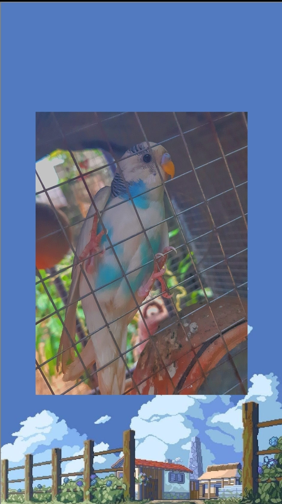
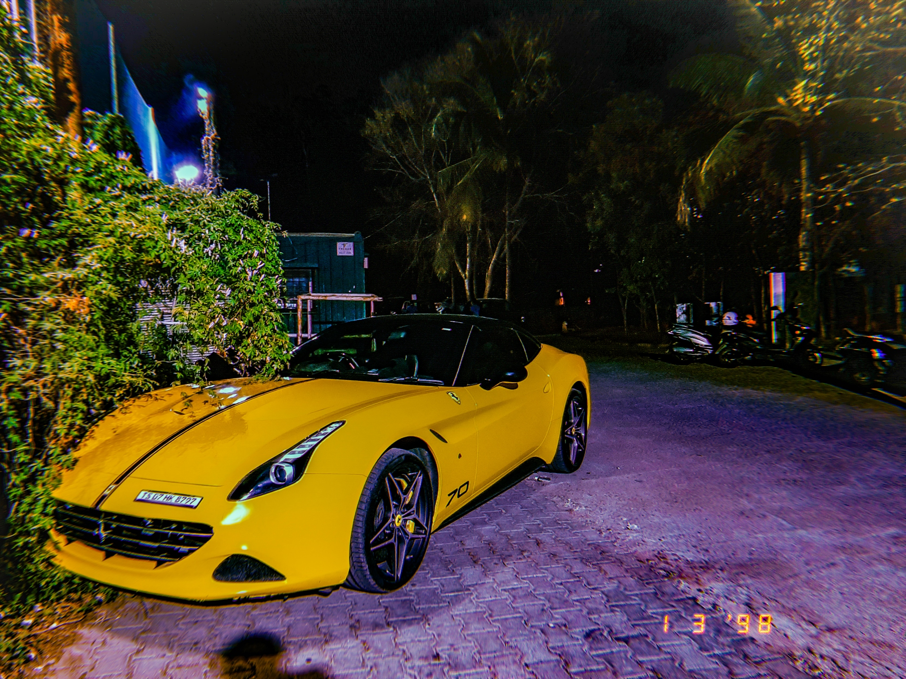
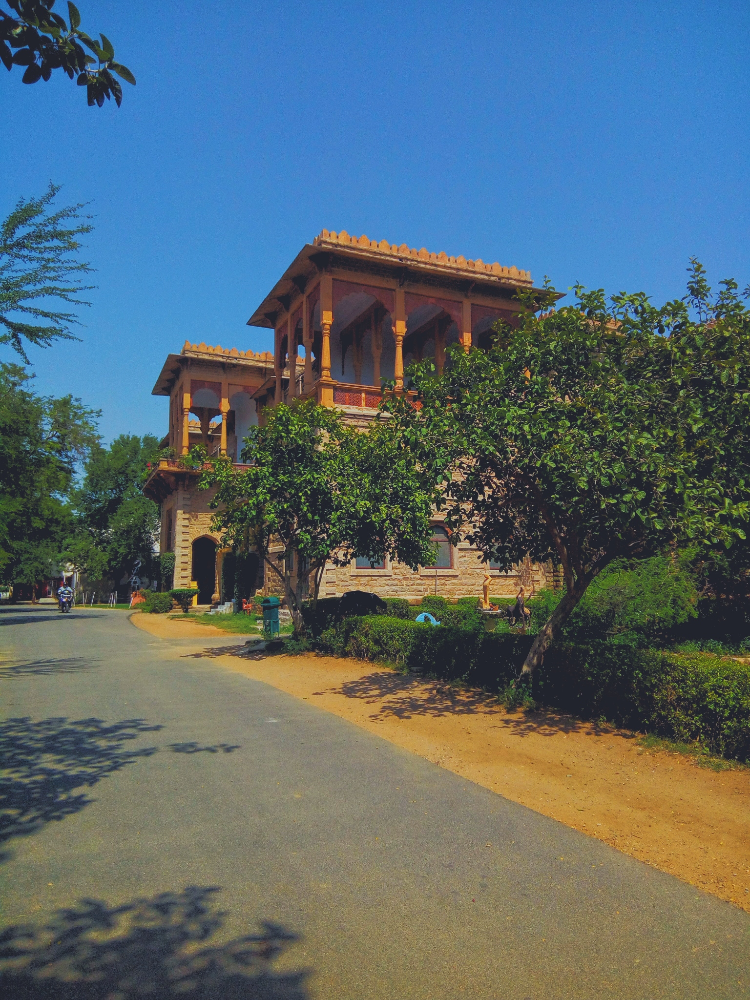
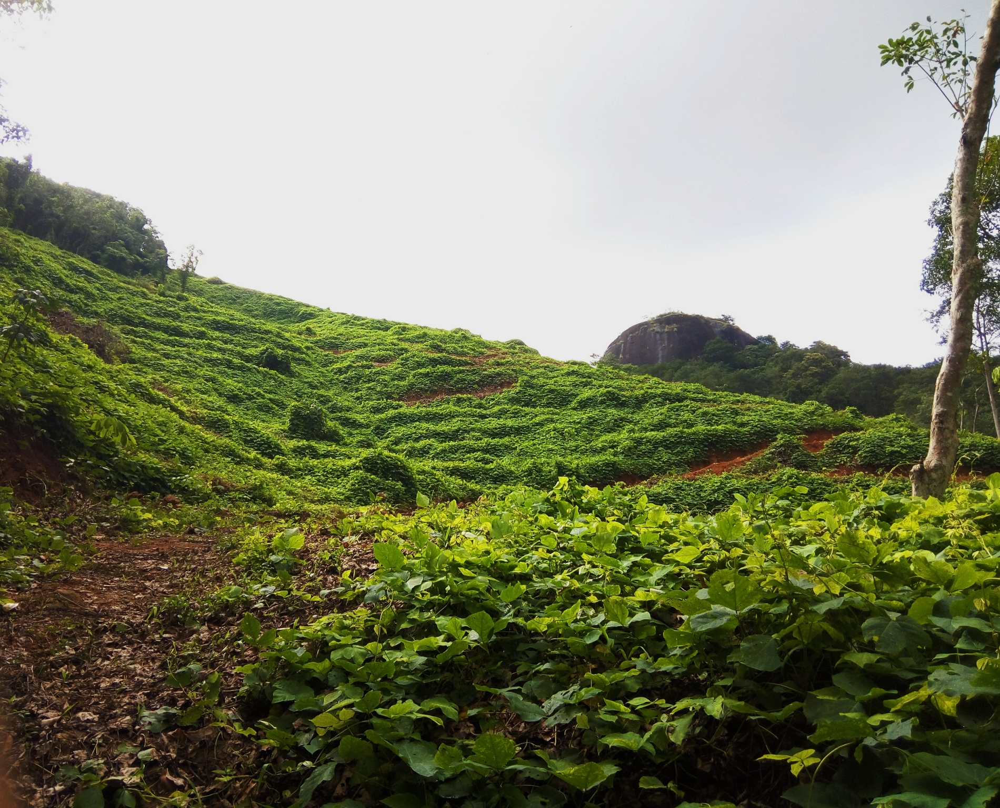
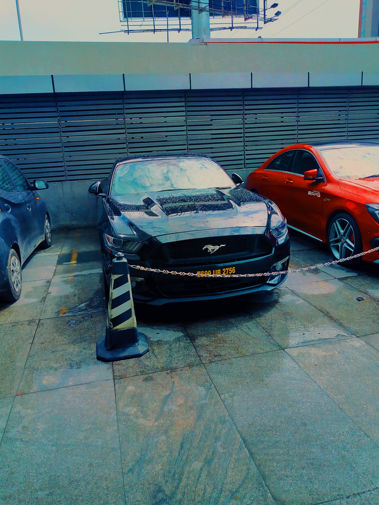

<html>
<title>W3.CSS Template</title>
<meta charset="UTF-8">
<meta name="viewport" content="width=device-width, initial-scale=1">
<link rel="stylesheet" href="https://www.w3schools.com/w3css/4/w3.css">
<link rel="stylesheet" href="https://fonts.googleapis.com/css?family=Lato">
<link rel="stylesheet" href="https://cdnjs.cloudflare.com/ajax/libs/font-awesome/4.7.0/css/font-awesome.min.css">

<body>

<!-- Navbar (sit on top) -->

  

    <a class="w3-bar-item w3-button w3-hover-black w3-hide-medium w3-hide-large w3-right" href="javascript:void(0);" onclick="toggleFunction()" title="Toggle Navigation Menu">
      <i class="fa fa-bars"></i>
    </a>
    <a href="#home" class="w3-bar-item w3-button">HOME</a>
    <a href="#about" class="w3-bar-item w3-button w3-hide-small"><i class="fa fa-user"></i> ABOUT</a>
    <a href="#portfolio" class="w3-bar-item w3-button w3-hide-small"><i class="fa fa-th"></i> PORTFOLIO</a>
    <a href="#contact" class="w3-bar-item w3-button w3-hide-small"><i class="fa fa-envelope"></i> CONTACT</a>
    <a href="#certificates" class="w3-bar-item w3-button w3-hide-small"><i class="fa fa-envelope"></i> CERTIFICATES</a>
    <a href="#" class="w3-bar-item w3-button w3-hide-small w3-right w3-hover-red">
      <i class="fa fa-search"></i>
    </a>
  

  <!-- Navbar on small screens -->
  

    <a href="#about" class="w3-bar-item w3-button" onclick="toggleFunction()">ABOUT</a>
    <a href="#portfolio" class="w3-bar-item w3-button" onclick="toggleFunction()">PORTFOLIO</a>
    <a href="#contact" class="w3-bar-item w3-button" onclick="toggleFunction()">CONTACT</a>
    <a href="#certificates" class="w3-bar-item w3-button" onclick="toggleFunction()">CERTIFICATES</a>
    <a href="#" class="w3-bar-item w3-button">SEARCH</a>
  

<!-- First Parallax Image with Logo Text -->

  

    MESS
  

<!-- Container (About Section) -->

  <h3 class="w3-center">ABOUT ME</h3>
  
CU'25

  

    

      
<b><i class="fa fa-user w3-margin-right"></i>Nikkitt Mesiliy</b>
 
      
    

    <!-- Hide this text on small devices -->
    

      
Welcome to my website :)

    

  

  

<!-- Container (Portfolio Section) -->

  <h3 class="w3-center">PICTURES CLICKED BY ME</h3>
  
<em>  Click on the images to make them bigger</em>
 

  <!-- Responsive Grid. Four columns on tablets, laptops and desktops. Will stack on mobile devices/small screens (100% width) -->
  

    

      
    

    

      
    

    

      
    

    

      
    

  

  

    

      
    

    

      
    

    

      
    

    

      
    

  

  
  

    

      
    

    
    

      
    

    
    

      
    

    
    

      
    

    <button href="https://vsco.co/nikkitt-/gallery" class="w3-button w3-padding-large w3-light-grey" style="margin-top:64px">LOAD MORE</button>
  

<!-- Modal for full size images on click-->

  <i class="fa fa-remove"></i>
  

    
    

  

<!-- Container (certificate Section) -->

  <h3 class="w3-center">MY CERTIFICATES</h3>
  
<em>  Click on the images to make them bigger</em>
 

  <!-- Responsive Grid. Four columns on tablets, laptops and desktops. Will stack on mobile devices/small screens (100% width) -->
  

    

      
    

    

      
    

    

      
    

    

      
    

  

  

<!-- Modal for full size images on click-->

  <i class="fa fa-remove"></i>
  

    
    

  

  
<!-- Third Parallax Image with Portfolio Text (image to add to be shown just before socials) 

  

  
     
  

 -->
  

<!-- Container (Contact Section) -->

Please follow me and like my content on:

<html>
<head>

</head>
<body>

  

    <a href="https://www.instagram.com/nikkittmesily"  target=”_blank”
    
  </a>
  

  

    
  

  

    
  

  

    
  

  

    
  

  

    
  

   

    
  

</body>
</html>

<!-- Footer -->
<footer class="w3-center w3-black w3-padding-64 w3-opacity w3-hover-opacity-off">
  <a href="#home" class="w3-button w3-light-grey"><i class="fa fa-arrow-up w3-margin-right"></i>To the top</a>
  
</footer>
 

<html>
  <body>
    <h1 style="text-align:center;">THANK YOU FOR VISITING MY WEBSITE :)</h1>
  </body>
</html>
  
